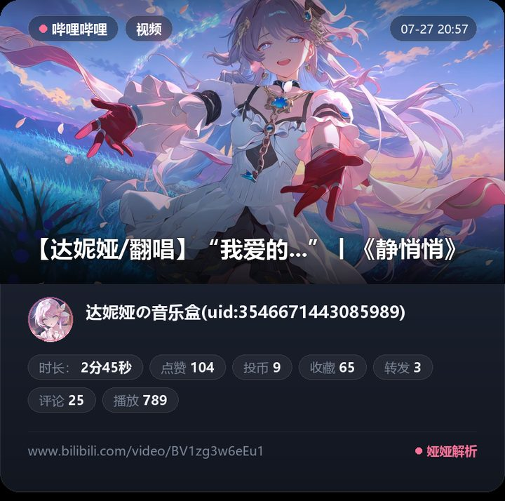
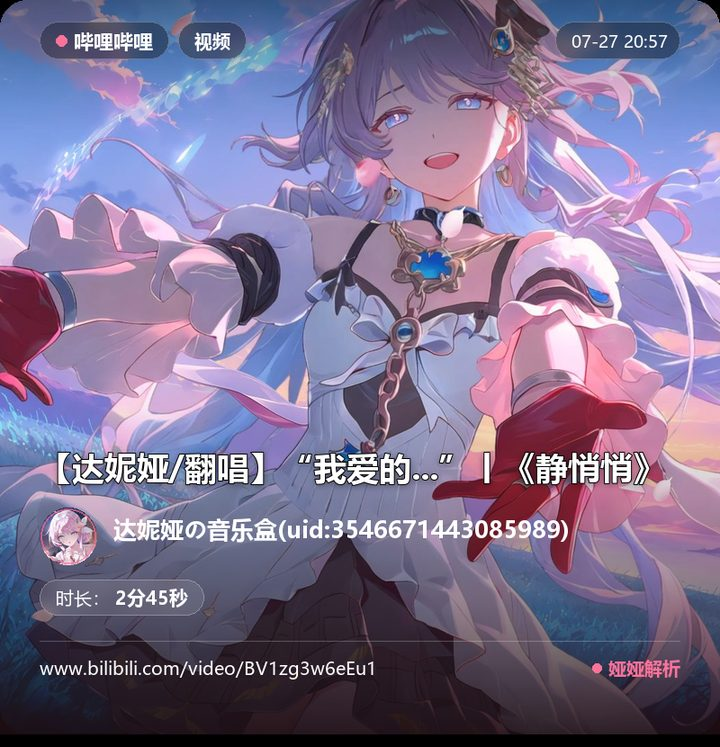

# 流媒体聚合解析器

_✨ 自动解析流媒体平台链接，转换为媒体直链发送 ✨_

---

## 🎀 娅娅改版特色

本仓库是 [astrbot_plugin_media_parser](https://github.com/drdon1234/astrbot_plugin_media_parser) 的个人改版「娅娅」，基于 v7.0.0 重建并保留全部上游能力，主要改动：

- 🎴 **卡片渲染**：移植 [astrbot_plugin_rika_share](https://github.com/iris1598/astrbot_plugin_rika_share) 的卡片渲染器，将标题、作者、封面、统计等信息渲染为图片卡片，支持 `标准` / `杂志` / `沉浸式` / `信息流` 四种布局与深/浅主题（在 `消息输出 → 附加内容：卡片渲染` 中配置）；B站卡片内置播放/点赞/投币/收藏/转发/评论/弹幕等统计药丸与简洁 BV 号展示，封面下载失败时自动使用内置兜底背景，修改视觉样式后会自动失效旧缓存并重渲染
- 💧 **修复小红书移动端水印**：移动端分享链接解析结果不再带水印
- 🔁 **其余能力均同步主仓库 v7.0.0**：B站 Cookie 高画质解析与管理员协助登录、媒体中转模式、下载器重写、全平台解析器重写、配置管理器重写等

示意卡片：

  
  

> 卡片渲染移植自 [astrbot_plugin_rika_share](https://github.com/iris1598/astrbot_plugin_rika_share)（MIT License），其底层基于 [nonebot-plugin-parser](https://github.com/maoxig/nonebot-plugin-parser) 的 CommonRenderer，保留原始许可声明。

---

## 📺 支持的流媒体平台

<table class="config-table">
<thead>
<tr>
<th>平台</th>
<th>支持的链接类型</th>
<th>支持能力</th>
</tr>
</thead>
<tbody>
<tr>
<td class="center"><strong>B站</strong></td>
<td>短链（<code>b23.tv/...</code>） 视频链接（<code>www.bilibili.com/video/av...</code>、<code>www.bilibili.com/video/BV...</code>） 番剧链接（<code>www.bilibili.com/bangumi/play/ep...</code>、<code>www.bilibili.com/bangumi/play/ss...</code>） 动态链接（<code>www.bilibili.com/opus/...</code>、<code>t.bilibili.com/...</code>） 小程序卡片（<code>message.meta.detail_1.qqdocurl</code>）</td>
<td class="center">视频 / 图片 / 文本 / 热评</td>
</tr>
<tr>
<td class="center"><strong>抖音</strong></td>
<td>短链（<code>v.douyin.com/...</code>） 视频链接（<code>www.douyin.com/video/...</code>） 图集/多分段链接（<code>www.douyin.com/note/...</code>、<code>www.douyin.com/slides/...</code>）</td>
<td class="center">视频 / 图片 / 文本</td>
</tr>
<tr>
<td class="center"><strong>TikTok</strong></td>
<td>短链（<code>vm.tiktok.com/...</code>、<code>vt.tiktok.com/...</code>） 视频链接（<code>www.tiktok.com/@.../video/...</code>） 图集链接（<code>www.tiktok.com/@.../photo/...</code>）</td>
<td class="center">视频 / 图片 / 文本</td>
</tr>
<tr>
<td class="center"><strong>快手</strong></td>
<td>短链（<code>v.kuaishou.com/...</code>） 作品链接（<code>www.kuaishou.com/...</code>、<code>gifshow.com/...</code>、<code>chenzhongtech.com/...</code>）</td>
<td class="center">视频 / 图片 / 文本</td>
</tr>
<tr>
<td class="center"><strong>微博</strong></td>
<td>博客链接（<code>weibo.com/...</code>、<code>m.weibo.cn/detail/...</code>、<code>weibo.cn/status/...</code>） 视频分享链接（<code>video.weibo.com/show?fid=...</code>、<code>weibo.com/tv/show/...</code>） 小程序卡片（<code>message.meta.detail_1.qqdocurl</code>）</td>
<td class="center">视频 / 图片 / 文本 / 热评</td>
</tr>
<tr>
<td class="center"><strong>小红书</strong></td>
<td>短链（<code>xhslink.com/...</code>、<code>xhslink.cn/...</code>） 笔记链接（<code>www.xiaohongshu.com/explore/...</code>、<code>www.xiaohongshu.com/discovery/item/...</code>） 小程序卡片（<code>message.meta.news.jumpUrl</code>）</td>
<td class="center">视频 / 图片 / 文本 / 热评</td>
</tr>
<tr>
<td class="center"><strong>闲鱼</strong></td>
<td>短链（<code>m.tb.cn/...</code>） 商品页（<code>www.goofish.com/item?id=...</code>、<code>h5.m.goofish.com/item?id=...&amp;itemId=...</code>）</td>
<td class="center">视频 / 图片 / 文本</td>
</tr>
<tr>
<td class="center"><strong>今日头条</strong></td>
<td>短链（<code>m.toutiao.com/is/...</code>） 文章链接（<code>www.toutiao.com/article/...</code>、<code>m.toutiao.com/article/...</code>） 视频链接（<code>www.toutiao.com/video/...</code>、<code>m.toutiao.com/video/...</code>） 微头条链接（<code>www.toutiao.com/w/...</code>、<code>m.toutiao.com/w/...</code>） 小程序卡片（<code>message.meta.news.jumpUrl</code>）</td>
<td class="center">视频 / 图片 / 文本</td>
</tr>
<tr>
<td class="center"><strong>小黑盒</strong></td>
<td>游戏详情链接（<code>www.xiaoheihe.cn/app/topic/game/...</code>） BBS 分享链接（<code>www.xiaoheihe.cn/app/bbs/link/...</code>） 小程序卡片（<code>message.meta.news.jumpUrl</code>）</td>
<td class="center">视频 / 图片 / 文本</td>
</tr>
<tr>
<td class="center"><strong>Twitter/X</strong></td>
<td>统一链接（<code>twitter.com/.../status/...</code>、<code>x.com/.../status/...</code>）</td>
<td class="center">视频 / 图片 / 文本</td>
</tr>
<tr>
<td class="center"><strong>Pixiv</strong></td>
<td>插画/漫画链接（<code>pixiv.net/artworks/...</code>、<code>pixiv.net/i/...</code>，支持 <code>/en/</code> 前缀）</td>
<td class="center">图片 / 文本</td>
</tr>
</tbody>
</table>

---

## 🚀 快速开始

### 安装

1. **依赖库**：插件安装时会依据 `requirements.txt` 安装 `aiohttp>=3.12`、`cryptography` 和本地二维码生成依赖 `qrcode[pil]`
2. **插件**：打开 AstrBot WebUI → 插件市场搜索 `astrbot_plugin_media_parser` 并安装

### 特性

- ✅ 开箱即用，无需配置即可解析大部分平台
- ✅ 自动识别并解析链接
- ✅ 每个平台可独立选择输出模式：全部发送、仅文本、仅富媒体或关闭
- ✅ 可选大模型翻译正文和标题，支持 AstrBot 内置 AI 或插件自定义 OpenAI 兼容接口
- ✅ 支持消息聚合策略：不聚合、全部聚合或按条件聚合
- ✅ 可将引用链接的解析详情和已下载媒体独立导出为 ZIP 文件
- ✅ 可选 B站 Cookie 解锁高画质 + 管理员协助自动续期
- ✅ 媒体中转模式，跨服务器部署无需共享目录

---

## 🧩 解析器与输出模式

在插件配置的 `解析器与输出模式` 中，每个平台都可以独立选择：

- `关闭`：不解析该平台链接
- `全部发送`：发送标题、作者、简介等文本元数据，并发送图片/视频
- `仅文本`：只发送文本元数据，不下载或发送图片/视频
- `仅富媒体`：只发送图片/视频，不发送文本元数据；热评不会获取或展示

默认所有平台均为 `全部发送`。

如只想保留某个平台的链接摘要，可以把该平台设为 `仅文本`；如只想要媒体内容，可以设为 `仅富媒体`

## 📝 文本元数据

`消息输出 → 文本元数据` 可以分别控制解析结果是否显示：

- 标题
- 作者
- 发布时间
- 原始链接
- 简介/正文

这些开关默认全部开启，只影响展示，不影响链接解析、媒体下载、访问限制、文件大小或错误提示。关闭标题或简介/正文后，对应字段也不会提交给翻译模型。对于正文较长、容易刷屏的平台，可以只保留标题、作者和原始链接。

QQ 普通文本消息没有可移植的“超链接文本”协议，因此插件不会把原始链接改写为第三方短链；可以直接关闭 `显示原始链接`，避免在解析结果中重复展示网址。

## 🌐 文本翻译

在插件配置的 `文本翻译` 中可开启正文翻译，也可选择同时翻译标题。翻译默认关闭；开启后支持两种大模型来源：

- `AstrBot 内置提供商`：复用 AstrBot 已配置的 AI，`选择 AstrBot AI` 留空时会尝试使用当前会话正在使用的 LLM
- `插件自定义提供商`：由本插件单独配置 OpenAI 兼容接口，内置 OpenAI、DeepSeek、通义千问、GLM、豆包、OpenRouter、SiliconFlow、Ollama 等常见 Base URL 预设

`翻译范围` 可选择 `仅正文` 或 `正文和标题`，热评不会翻译。每条链接会独立请求一次翻译，标题和简介/正文合计默认不超过 4000 字；翻译结果会作为独立节点发送。翻译与媒体下载并行执行，发送前统一收口，因此按条件聚合统计会包含最终翻译节点。翻译失败或响应格式异常时会自动跳过翻译节点，不影响媒体解析和发送。

## 📦 消息聚合与 ZIP 归档

在插件配置的 `消息输出 → 发送行为：消息聚合 → 聚合模式` 中可以选择：

- `不聚合`：逐条发送文本、图片和视频
- `全部聚合`：尽量使用消息集合发送，超过大视频阈值的媒体仍会单独发送
- `按条件聚合`：当可进入合并转发的图片、视频或最终节点数达到阈值时使用消息集合

`按条件聚合阈值` 位于 `消息输出 → 发送行为：消息聚合 → 按条件聚合阈值`，仅在选择 `按条件聚合` 时生效；阈值填 `0` 表示不按该项触发。统计包含翻译节点，不包含随后会单独发送的大媒体节点。

`消息输出 → 富媒体展示 → 视频仅发送封面` 开启后，插件不会发送视频节点，会把每个视频改为图片节点发送：解析结果自带封面时直接使用封面；没有封面时会尝试用 ffmpeg 截取视频第一帧作为封面。无封面截帧依赖缓存目录可用且运行环境存在 ffmpeg。

`消息输出 → 文本元数据 → 引用用户消息` 可在不聚合时让文本元数据节点引用对应的用户消息；媒体节点和合并转发消息不引用。

ZIP 是独立导出能力。在 `消息输出 → 导出行为：ZIP 归档 → 引用链接归档命令` 中填写命令后，引用包含可解析链接的消息，并发送一条只包含该命令的消息即可生成 ZIP；命令不能与清理缓存关键词相同。归档始终使用稳定的 `media_parser/序号_标题/` 目录结构，不受聊天聚合模式、文本展示开关或“视频仅发送封面”影响；每条链接包含便于阅读的 `metadata.txt` 和白名单化的 `details.json`，可下载媒体写入归档，无法取得的媒体会记录原链接和失败原因。媒体总量受 `归档媒体总大小上限` 约束（有效范围 1–4096 MB），媒体文件使用无损直存以避免无效压缩占用 CPU。发送后源媒体立即清理；ZIP 本体至少保留 300 秒，以兼容 AstrBot/协议端延迟拉取，并通过持久过期标记兜底回收。

`解析频率限制` 默认关闭。可分别设置 `同链接限制` 和 `同用户限制` 的 `最多解析次数` 与 `时间窗秒数`；次数为 `0` 表示不限制。链接计数会使用清洗后的标准链接，过滤分享者、来源和追踪参数；短链解析完成后也会记录平台返回的最终链接别名。解析记录会持久化到插件运行时目录，并按已启用限制中的最大时间窗自动裁剪，避免记录无限增长。

---

## ⚙️ 优化体验

确保 **缓存目录** 可用能显著提升解析成功率和发送体验

> **原因**：消息平台使用直链发送媒体时无法指定 header、referer、cookie 等参数，部分风控严格的平台会返回 403 Forbidden  
> **建议**：确保媒体缓存目录可用；Docker 部署时请将缓存目录配置为协议端可访问的共享目录，非 Docker 环境会自动使用 AstrBot 插件数据目录

### 各平台特殊情况

**硬性要求（必须缓存目录可用）**
- **图片**：当前实现图片均下载到缓存后发送，缓存目录不可用时图片会被跳过
- **B站**：启用 Cookie 高画质后，若解析返回 DASH 音视频流，需要下载并合并后发送
- **微博**：视频必须正确携带 referer 参数才能下载，会强制缓存后发送
- **小黑盒**：视频、BBS 媒体和 M3U8 格式需要下载到本地；M3U8 分片会合并后发送
- **Twitter/X**：视频会强制缓存后发送

**概率风控（建议缓存目录可用）**
- **TikTok**：受地区和风控影响较明显，必要时请同时配置代理
- **小红书**：部分媒体有身份验证和时效性，缓存发送更稳定
- **Pixiv**：图片必须先下载到缓存；受地区限制时需开启 Pixiv 代理

**提高性能（可选）**
- **B站**：支持 Range 并发下载提升速度；Cookie 登录后 DASH 音视频流也可独立 Range 加速
- **Twitter/X**：支持 Range 请求，配置缓存目录后可并发下载提升速度

> 💡 Range 下载仅为性能优化：服务器必须返回严格匹配的 `206 + Content-Range` 才会启动分片；忽略 Range 的服务器会立即降级为单流下载。未配置缓存目录时普通视频会尽量退化为直链发送；必须缓存的媒体会被跳过并在文本中说明原因。

---

## 🍪 B站 Cookie 与画质增强

配置 Cookie 后可解锁更高画质（如 1080P+、4K），视频通过 DASH 音视频流下载

### 配置方式

1. 在 `B站增强 → 携带 Cookie 解析` 中开启
2. 填入 B站 Cookie（浏览器 F12 → Network → 任意请求的 Cookie 头）
3. 选择 `最高画质`（实际画质取决于账号会员等级和视频源）
4. **前置条件**：媒体缓存目录必须可用

> **注意**：缓存目录不可用时，插件会自动旁路 B站 Cookie、DASH 下载和管理员协助登录，回退到无 Cookie 直链解析路径

### 管理员协助登录

Cookie 会过期失效，开启 `管理员协助登录` 后，当 Cookie 失效时插件会自动私聊管理员，引导通过扫码重新登录：

1. 在 `权限控制 → 管理员 ID` 填写你的用户 ID
2. 在 `B站增强 → 管理员协助登录` 中开启
3. Cookie 失效时，插件向管理员私聊发送确认请求
4. 管理员回复确认后，收到登录二维码/链接
5. 扫码完成后 Cookie 自动更新，无需手动替换

也可以直接在管理员私聊发送 `主动更新 Cookie 指令`（默认 `B站更新Cookie`），立即发起扫码更新，不受自动请求冷却限制。该指令只接受管理员私聊，留空即可关闭主动入口。

> **参数说明**：`回复超时` 控制等待管理员确认的时间（默认 1440 分钟）；`请求冷却` 只控制自动检测触发的协助请求。B站二维码有效期由服务端控制，插件会在约 3 分钟内结束轮询。

---

## 🖼️ Pixiv Cookie 与代理

Pixiv 支持插画和漫画的多页图片解析，优先下载原图，原图不可用时自动尝试较低分辨率图片。
解析结果会附带作品标签，并标注 R-18、R-18G 和 AI 生成状态。

1. 公开作品通常可直接解析；需要登录或受年龄限制的作品应在 `Pixiv 设置 → Pixiv Cookie` 中填写包含 `PHPSESSID` 的完整 Cookie
2. 无法直连 Pixiv 时，填写 `代理设置 → 代理地址` 并开启 `Pixiv 解析与图片下载使用代理`
3. Pixiv 图片需要携带 Referer 下载并缓存后发送，因此媒体缓存目录必须可用

Cookie 仅用于访问 Pixiv，不会写入日志或发送到消息平台。Cookie 失效或遭遇 Cloudflare 拦截时，解析结果会返回对应错误提示。

---

## 🔁 媒体中转模式

当 AstrBot 与消息平台协议端（如 NapCat、Lagrange）**不在同一台机器**或**无法共享文件目录**时，本地下载的媒体文件对协议端不可达。

媒体中转模式通过 AstrBot 内置 HTTP 服务桥接，将已缓存的本地文件转为可回调的临时 URL 发送。

### 适用场景

- AstrBot 和协议端分别部署在不同服务器
- Docker 容器间未挂载共享目录
- 协议端无法通过 `file://` 协议访问 AstrBot 本地文件

### 配置方式

1. 在 `媒体中转 → 启用` 中开启
2. 填写 `AstrBot 回调地址`：协议端能访问到 AstrBot 的 HTTP 地址（如 `http://192.168.1.100:6185`）
   - 同机部署可用 `http://localhost:6185`
   - 跨服务器需填公网 IP 或域名
   - 留空时会尝试使用 AstrBot 全局回调地址
3. 设置 `中转缓存有效期`（默认 300 秒），到期后临时链接失效并自动清理缓存

> **注意**：开启媒体中转后，不会强制下载所有媒体，也不会自动切换缓存目录；它只会增强已经成功缓存到本地的媒体文件。Token 注册失败时会自动回退为本地文件发送

---

## 📝 注意事项

- **B站**：只有在配置有效 Cookie 且缓存目录可用时，才能解锁高画质和 DASH 下载；否则会回退到普通解析路径
- **TikTok**：受地区和风控影响较明显，必要时请开启代理
- **微博**：视频下载依赖 referer，通常需要缓存目录可用
- **小红书**：移动分享链会优先改写到 PC `explore` 页面获取兼容的无水印 H.264 `masterUrl`，失败时回退原分享页；登录墙和 `xsec_token` 时效仍可能影响解析
- **小黑盒**：BBS 分享和部分视频解析依赖 `cryptography` 库；游戏预览视频下载速度不佳（Steam CDN）时建议启用代理
- **Twitter/X**：图片和视频 CDN 大多需要代理环境，建议按需开启代理
- **Pixiv**：登录或年龄限制作品需要有效 Cookie；受地区限制时需同时代理解析请求和图片下载
- **图片处理**：非 JPG/PNG 图片会尝试转换为 PNG；转换工具不可用或转换失败时保留原格式，并在解析信息中记录警告，不再伪装成已转换成功
- **HLS**：会选择最高分辨率变体并用 ffmpeg 正确封装；当前明确拒绝 `EXT-X-BYTERANGE` 清单，避免静默生成损坏文件
- **代理与安全 DNS**：媒体连接只允许公网地址；显式配置的代理地址会被视为受信连接端点。Clash/TUN `fake-ip` 模式常把公网域名映射到保留网段 `198.18.0.0/15`，直连时会被安全策略拒绝，请改用 `redir-host`/真实 DNS，或显式配置受信代理。代理端对目标域名的最终解析属于代理信任边界
- **其他**：插件按事件发送者身份跳过机器人自身消息以防重复解析，不会因普通用户文本包含“原始链接”而误伤；直播链接会自动跳过

---

## 🙏 鸣谢

- [bilibili-API-collect](https://github.com/SocialSisterYi/bilibili-API-collect) - B站解析端点
- [FxEmbed](https://github.com/FxEmbed/FxEmbed) - Twitter/X 解析服务
- [ParseHub](https://github.com/z-mio/ParseHub) - 小黑盒 BBS 帖子解析方法
- [tianger-mckz](https://github.com/drdon1234/astrbot_plugin_bilibili_bot/issues/1#issuecomment-3517087034) | [ScryAbu](https://github.com/drdon1234/astrbot_plugin_media_parser/issues/16#issuecomment-3726729850) | [WWWA7](https://github.com/drdon1234/astrbot_plugin_media_parser/pull/17#issue-3799325283) - QQ小程序卡片链接提取方法
- [CSDN 博客](https://blog.csdn.net/qq_53153535/article/details/141297614) - 抖音解析方法
- [astrbot_plugin_rika_share](https://github.com/iris1598/astrbot_plugin_rika_share) - 卡片渲染器移植来源（MIT License）
- [Johnserf-Seed/f2](https://github.com/Johnserf-Seed/f2) - 抖音 `a_bogus` 签名实现来源；移植部分遵循 Apache-2.0，完整文本见 `LICENSES/Apache-2.0.txt`

## 🤝 社区贡献与扩展

- 如需解析 YouTube 平台链接，请下载带有 v4.3.1-yt-feature 标签的版本（贡献者：[shangzhimingge](https://github.com/shangzhimingge)）
- 欢迎提交 PR 以添加更多平台解析支持和新功能
